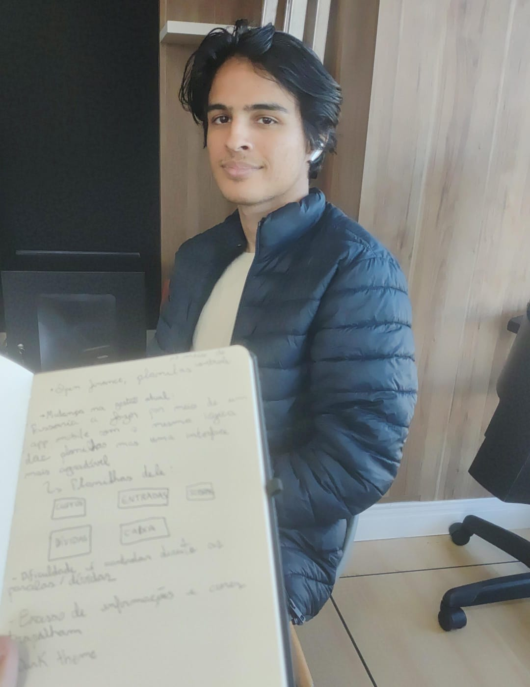
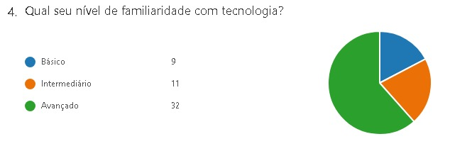
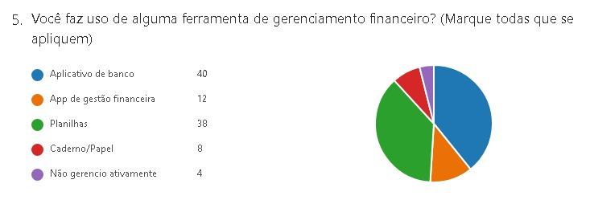
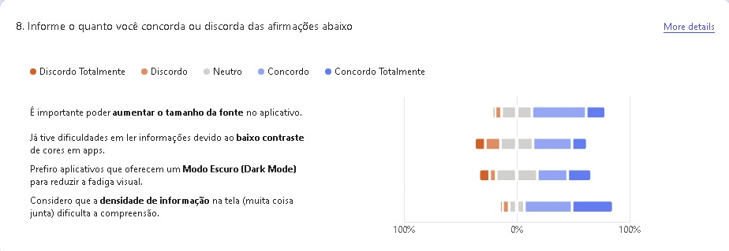
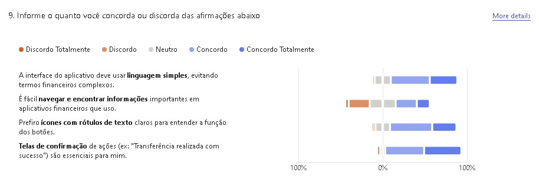
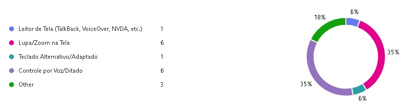

## (c) Métodos de Pesquisa, Justificativa e Descobertas

Para entender os problemas e o contexto dos usuários, selecionamos dois métodos complementares do IDEO: **Entrevistas (Interviews)** e **Pesquisas (Surveys)**.

### Método 1: Entrevistas (Interviews)

* **Justificativa:** Escolhemos entrevistas para obter dados qualitativos profundos. Elas nos permitem entender o *porquê* por trás das frustrações dos usuários, capturando emoções e contextos específicos (como a confusão com "muitas opções") que um formulário quantitativo não conseguiria. 
* **Dados Entrevista n1:**
    * A entrevistada já tenta se organizar (usa app "Minhas Economias" e planilhas), mas ainda sente "falta de clareza".
    * **Problema Principal:** Os apps atuais são confusos, têm "muitas opções de funcionalidade" e exigem muito esforço para registrar um simples gasto ("preencher muita coisa").
    * **Problema de Visualização:** Dificuldade em entender *onde* está gastando (ex: "qual banco"), sugerindo que os gráficos atuais são ineficazes.
    * **Problema de Automação:** A conexão bancária (Open Finance) falha na categorização, o que gera retrabalho e desconfiança.
    * **Desejo (Oportunidade):** A usuária busca simplicidade ("fácil navegação, menos botões"), quer saber "o quanto ainda pode gastar" (foco no futuro, não só no passado) e valoriza acessibilidade (letra personalizada).

* **Dados Entrevista n2:**
    * O entrevistado utiliza planilhas feitas por ele mesmo para controle financeiro.
    * **Problema Principal:** Não há uma integração com o banco, de modo que o saldo esteja em tempo real, tendo um open finance. É uma aplicação completamente autogerenciada, de modo que não tem automações ou um fácil registro/análise nas planilhas.
    * **Problema de Visualização:** Dificuldade em entender as parcelas já existente, alegando que não entende exatamente quando dada parcela vai se encerrar. Apontou também dificuldade ao lidar com cores fortes, distraindo-se muito fácil.
    * **Desejo (Oportunidade):** O usuário busca um serviço que supra com boa UI suas planilhas.

* **Dados Entrevista n3:**
    * O entrevistado utiliza planilha + bloco de notas manual.
    * **Problema Principal:** Dificuldade em controle de pequenos gastos, de modo a não ter tempo e aptidão para inserir todos os gastos corretamente.
    * **Desejo (Oportunidade):** Busca facilitar a inserção de gastos via mobile pela portabilidade e assim largaria o bloco de notas. A planilha encontra-se no desktop, e não consegue acessar a qualquer horário.

    
    
### Método 2: Pesquisas (Surveys via Forms)

* **Justificativa:** Enquanto a entrevista nos deu profundidade (o "porquê"), a pesquisa (Survey) foi usada para obter amplitude (o "quantos"). O objetivo foi validar se as frustrações encontradas na Entrevista n1 (complexidade, visualização ruim) eram comuns a um grupo maior de pessoas e coletar dados demográficos sobre nosso público.
* **A partir dos dados coletados no formulário, descobrimos o seguinte:

*    Perfil dos usuários: Verificamos que a vasta maioria das pessoas que respondeu o forms é da área da tecnologia e possuem cargos sêniores, o que explica a necessidade deles de funcionalidades mais avançadas de investimento.

     

*    Ferramentas Atuais: Os usuários gerenciam finanças majoritariamente via Aplicativos de Banco e Planilhas.

     

*    Prioridades de Usabilidade e comunicação, o feedback indica uma alta demanda por interfaces simples, claras e diretas:
   *    Evitar jargões financeiros complexos. Usar linguagem natural e direta.
   *    Investir em uma arquitetura de informação e navegação excepcionalmente clara.
   *    Telas de confirmação de ações (transações, cadastros) são essenciais.
   *    Usar ícones com rótulos de texto claros para garantir a compreensão da função dos botões.

   
   

*    Acessibilidade e Design Visual (UX/UI)
As preferências dos usuários destacam a importância de opções de personalização visual e legibilidade:

*   Design Visual:

   Modo Escuro (Dark Mode): Certa preferência.
   Densidade de Informação: Evitar telas com "muita coisa junta". Priorizar layouts limpos e com bom espaçamento.

*   Acessibilidade:
  
   Conforme respondido pelos usuários, as tecnologias assistivas mais utilizadas são de Lupa/Zoom na tela e de controle por ditado de voz. Implementaremos essas funcionalidades para auxiliar na leitura e usabilidade da aplicação no geral.

   

---
